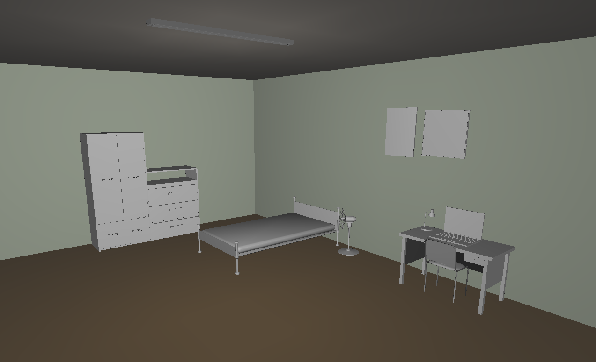

# Projeto Final em OpenGL
- **Aluno**: John Victor Farias de Omena
- **Professor**: Marcelo Costa Oliveira

## Requisitos AB1
- [x] Modelar o interior do Quarto: paredes, teto, piso, etc
- [x] 5 objetos, além da cama, mesa, cadeira, ventilador e quadro
- [x] 1 Porta: a porta do Quarto deverá ser aberta e fechada usando o teclado
- [x] 1 Janela: a janela deverá ser aberta e fechada usando o teclado
- [x] Navegacao com o teclado/mouse na modelagem permitindo ao usuário visualizar o Quarto em 360º

## Codigo de compilação e execução

- g++ main.cpp bibutil.cpp -o main -lGL -lGLU -lglut -lglfw3
- ./main

## Vídeo de demonstração (Youtube)

https://youtu.be/86o_8wFfEWU

## Imagem da modelagem

